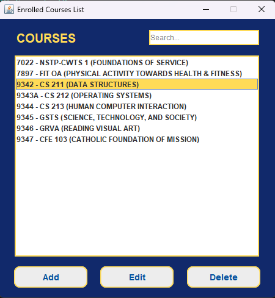
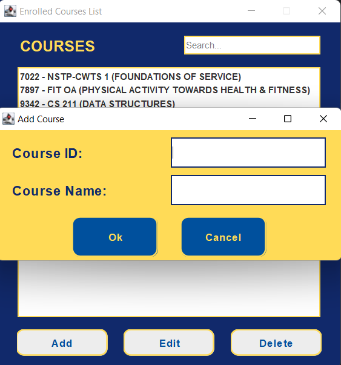
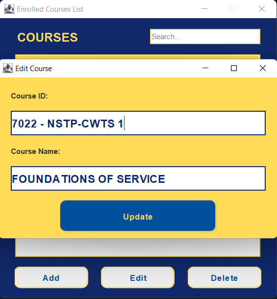
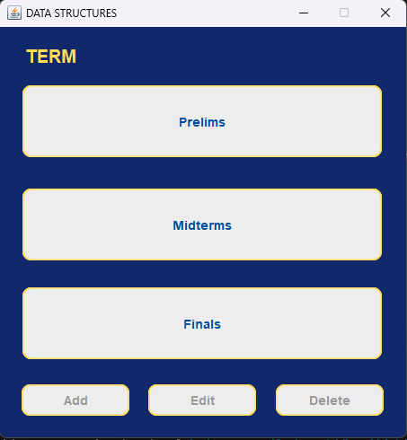
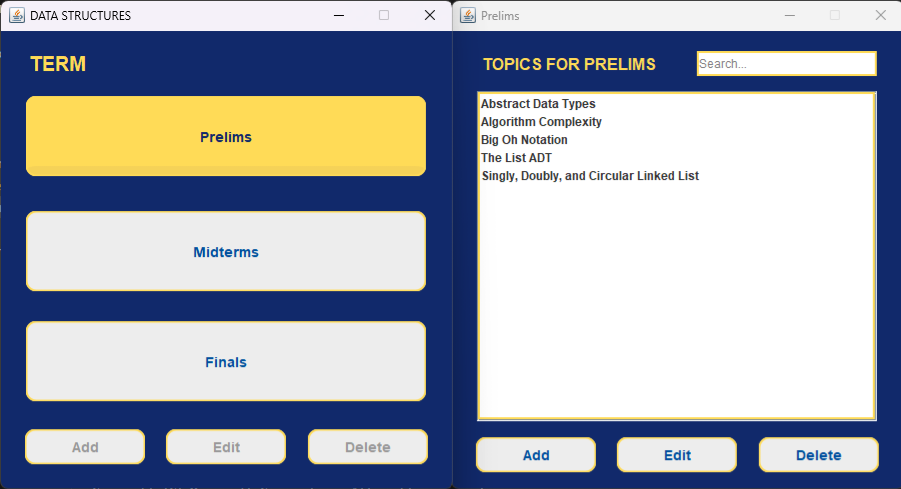
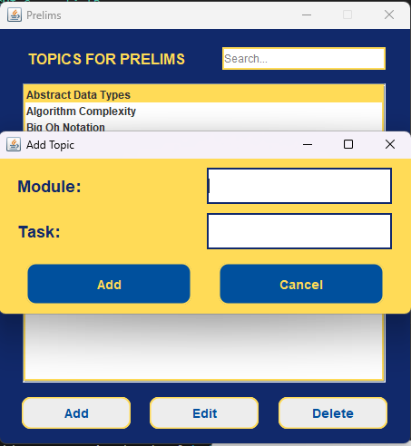
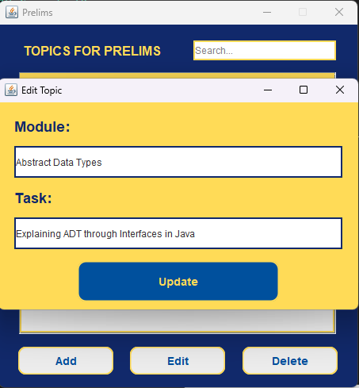
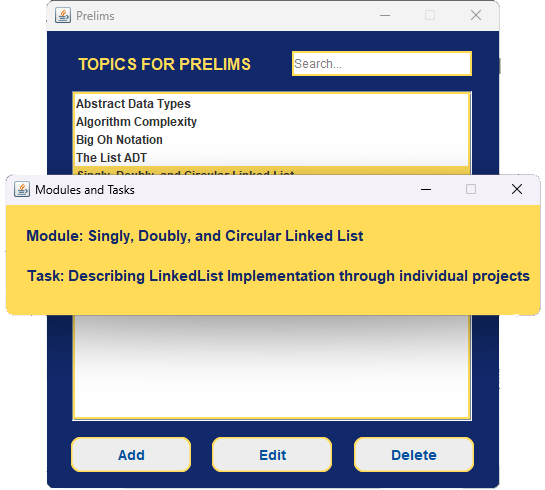

# CS211_9342_midGroupB

## Group Project 

A group programming project for the course CS 211 - DATA STRUCTURES (AY 2023-2024).

### Authors and Acknowledgment

**Group B**
1. **COLOMA**, Stephen M.
2. **GUZMAN**, Sanchie Earl M.
3. **NONATO**, Marius Glenn M.
4. **RAGUDOS**, Hannah T.
5. **RAMOS**, Jerwin Kyle R.
6. **ROQUE**, Rey Daniel L.
7. **SANTOS**, Lourdene Eira C.

---

## Group Project 1: Comparative Analysis of Sorting Algorithms

This project aims to perform a comparative analysis of three sorting algorithms: Bubble Sort, Insertion Sort, and Selection Sort.

### Sorting Util Classes

- **Prelims.Project1.BubbleSort.java**: Contains the implementation of the Bubble Sort algorithm.

- **Prelims.Project1.InsertionSort.java**: Holds the implementation of the Insertion Sort algorithm.

- **Prelims.Project1.SelectionSort.java**: Features the implementation of the Selection Sort algorithm.

### Technical Report, Data Files, and More

For a report of our findings, methodology, and results, refer to our detailed [MixAndMatchPrelimGroupProjectOnAlgorithmAnalysis](https://docs.google.com/document/d/1gKtJAHLXlthI0EKCrLfHiYVjrzdE2HUzpNh-_AHTRSQ/edit).

Data files for various sizes and scenarios can be found in the `Prelims.Project1.dataset` directory.

---

## Group Project 2: Linked List-based Implementation

This section provides information about our second project, which utilizes linked lists for its implementation.

### GUI and Utility Classes

- **Prelims.Project2.GUI**: Describes the primary GUI components of our application.

- **Prelims.Project2.UtilGUI**: Contains utility GUI classes that support the main GUI.

- **Prelims.Project2.LinkedListImplementation**: Provides the core linked list functionality for our system.

### Sample Run

1. On course list page

2. Adding course in course list

3. Editing course in course list

4. On term list page

5. On topic list page with selected term

6. Adding topic in topic list

7. Editing topic in topic list

8. On module and task page

---

## Troubleshooting

For any questions or further assistance regarding the projects, reach out to our project team:

- Stephen M. COLOMA
- Sanchie Earl M. GUZMAN
- Marius Glenn M. NONATO
- Hannah T. RAGUDOS
- Jerwin Kyle R. RAMOS
- Rey Daniel L. ROQUE
- Lourdene Eira C. SANTOS

---

## General Instructions

For instructions on working with the source code:

1. Clone the project.
2. Create a feature branch.
3. Edit the source code.
4. Commit changes.
5. Push the feature branch.
6. Create a merge request.

**Note:** Avoid merging changes directly into the main branch. Always use the feature branch and merge request method.

---

Explore and learn from our comparative analysis and linked list implementation.

